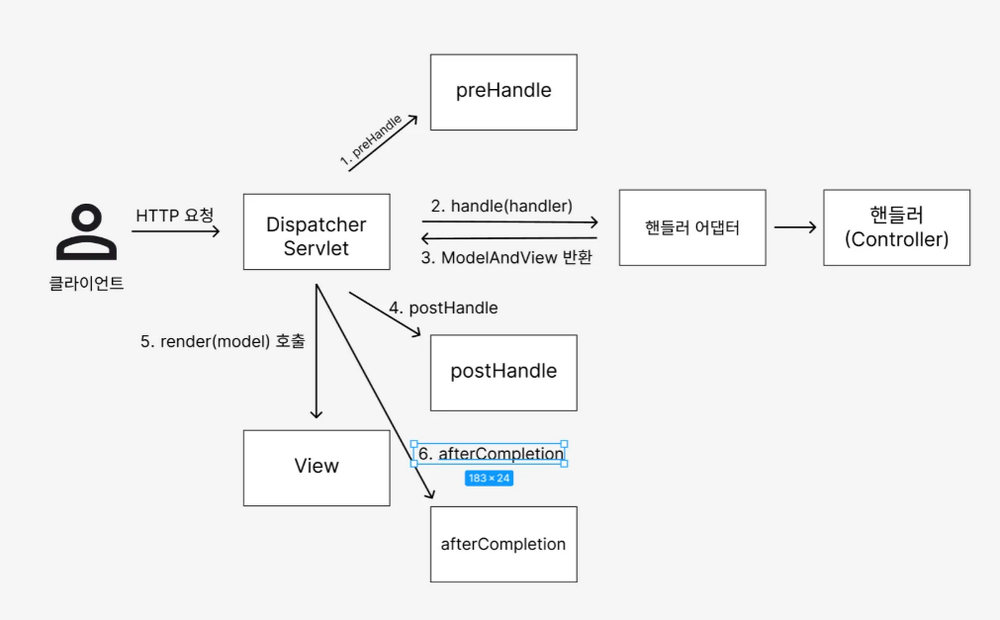

## 필터, 인터셉터

**서블릿 필터 - 소개**

- 공통 관심 사항
    - 요구사항을 보면 로그인한 사용자만 상품 관리 페이지에 들어갈 수 있어야 한다.
    - 로그인을 하지 않은 사용자에게는 상품 관리 버튼이 보이지 않기 때문에 문제가 없어 보인다.
    - 로그인 하지 않은 사용자도 URL을 직접 호출하면 상품 관리 화면에 들어갈 수 있다.
    - 상품 관리 컨트롤러에서 로그인 여부를 체크하는 로직을 하나하나 작성하면 되겠지만, 등록, 수정, 삭제, 조회 등등 상품관리의 모든 컨트롤러 로직에 공통으로 로그인 여부를 확인해야 한다.
    - 더 큰 문제는 향후 로그인과 관련된 로직이 변경될 때이다.
    - 작성한 모든 로직을 다 수정해야 할 수도 있다.
    - 이렇게 애플리케이션 여러 로직에서 공통으로 관심 있는 것을 공통 관심사(cross-cutting concern)라고 한다.
    - 여기서는 등록, 수정, 삭제, 조회 등등 여러 로직에서 공통으로 인증에 대해서 관심을 가지고 있다.
    - 이러한 공통 관심사는 스프링의 AOP로도 해결할 수 있지만, 웹과 관련된 공통 관심사는 지금부터 설명할 서블릿 필터 또는 스프링 인터셉터를 사용하는 것이 좋다.
    - 웹과 관련된 공통 관심사를 처리할 때는 HTTP의 헤더나 URL의 정보들이 필요한데, 서블릿 필터나 스프링 인터셉터는 `HttpServletRequest`를 제공한다.
    - “특정 URL로 오는 것 다 막아!” ← 이런 것들도 가능하다.

**서블릿 필터 소개**

필터는 서블릿이 지원하는 수문장이다. 필터의 특성은 다음과 같다.

- 필터 흐름

    ```java
    HTTP 요청 -> WAS -> 필터 -> 서블릿 -> 컨트롤러
    ```

    - 필터를 적용하면 필터가 호출 된 다음에 서블릿이 호출
    - 그래서 모든 고객의 요청 로그를 남기는 요구사항이 있다면 필터를 사용하면 된다.
    - 참고로 필터는 특정 URL 패턴을 적용할 수 있다. `/*` 이라고 하면 모든 요청에 필터가 적용.
    - 참고로 스프링을 사용하는 경우 여기서 말하는 서블릿은 스프링의 디스패처 서블릿으로 생각하면 된다.
- 필터 제한

    ```java
    HTTP 요청 -> WAS -> 필터 -> 서블릿 -> 컨트롤러
    HTTP 요청 -> WAS -> 필터(적절하지 않은 요청이라 판단, 서블릿 호출 X) -> 비 로그인 사용자
    ```

    - 필터에서 적절하지 않은 요청이라고 판단하면 거기에서 끝을 낼 수도 있다.
    - 그래서 로그인 여부를 체크하기에 딱 좋다.
- 필터 체인

    ```java
    HTTP 요청 -> WAS -> 필터1 -> 필터2 -> 필터3 -> 서블릿 -> 컨트롤러
    ```

    - 필터는 체인으로 구성되는데, 중간에 필터를 자유롭게 추가 가능.
    - 예를 들어서 로그를 남기는 필터를 먼저 적용하고, 그 다음에 로그인 여부를 체크하는 필터를 만들 수 있다.

    ```java
    public interface Filter{
    		public default void init(FilterConfig filterConfig) throws ServletException {}
    		
    		public void doFilter(ServletRequest request, ServletResponse response,
    			FilterChain chain) throws IOException, ServletException;
    			
    		public default void destroy() {}
    }
    ```

    - 필터 인터페이스를 구현하고 등록하면 서블릿 컨테이너가 필터를 싱글톤 객체로 생성하고 관리한다.
    - `init():` 필터 초기화 메서드, 서블릿 컨테이너가 생성될 때 호출
    - `doFilter()`: 고객의 요청이 올 때 마다 해당 메서드가 호출된다. 필터의 로직을 구현하면 된다.
    - `destroy():` 필터 종료 메서드, 서블릿 컨테이너가 종료될 때 호출된다.
    - **싱글톤 객체이기 때문에 `spring bean` 처럼 하나만 등록되고 하나만 사용되기 때문에 조심해서 사용해야 한다.**

---

## 서블릿 필터 - 요청 로그

필터가 정말 수문장 역할을 잘 하는지 확인하기 위해 가장 단순한 필터인, 모든 요청을 로그로 남기는 필터를 개발하고 적용해보자.

- **LogFilter - 로그 필터**

```java
package hello.login.web.filter;

import java.io.IOException;
import java.util.UUID;
import javax.servlet.Filter;
import javax.servlet.FilterChain;
import javax.servlet.FilterConfig;
import javax.servlet.ServletException;
import javax.servlet.ServletRequest;
import javax.servlet.ServletResponse;
import javax.servlet.http.HttpServletRequest;
import lombok.extern.slf4j.Slf4j;

@Slf4j
public class LogFilter implements Filter {
    @Override
    public void init(FilterConfig filterConfig) throws ServletException {
        log.info("log filter init");
    }

    @Override
    public void doFilter(ServletRequest request, ServletResponse response, FilterChain chain)
            throws IOException, ServletException {
        log.info("log filter doFilter");

        HttpServletRequest httpRequest = (HttpServletRequest) request;
        //servletRequest httpServletRequest의 부모 클래스인데
        //기능이 거의 없어서 다운 캐스팅을 해주어야 한다.
        String requestURI = httpRequest.getRequestURI();

        String uuid = UUID.randomUUID().toString();

        try{
            log.info("REQUEST [{}][{}]", uuid, requestURI);
            chain.doFilter(request, response);
        } catch (Exception e){
            throw e;
        } finally {
            log.info("RESPONSE [{}][{}]", uuid, requestURI);
        }
    }

    @Override
    public void destroy() {
        log.info("log filter destroy");
    }
}

```

- `public class LogFilter implements Filter{}`
    - 필터를 사용하려면 필터 인터페이스를 구현
- `doFilter(ServletRequest request, ServletResponse response, FilterChain chain)`
    - HTTP 요청이 오면 `doFilter` 가 호출
    - `ServletRequest request` 는 HTTP 요청이 아닌 경우까지 고려해서 만든 인터페이스이다.
    - HTTP를 사용하면 `HttpServletRequest httpRequest = (HttpServletRequest) request;` 와 같이 다운 케스팅을 하면 된다.
- `String uuid = UUID.randomUUID().toString();`
    - HTTP 요청을 구분하기 위해 요청당 임의의 `uuid` 를 생성해둔다.
- `log.info("REQUEST [{}][{}]", uuid, requestURI);`
    - `uuid` 와 `requestURI` 를 출력.
- `chain.doFilter(request, response);`
    - 이 부분의 가장 중요하다. 다음 필터가 있으면 필터를 호출하고, 필터가 없으면 서블릿을 호출.
    - 만약 이 로직을 호출하지 않으면 다음 단계로 진행되지 않는다.
    - **즉, 컨트롤러가 호출되지 않는다.**
- **WebConfig**

```java
package hello.login;

import hello.login.web.filter.LogFilter;
import javax.servlet.Filter;
import org.springframework.boot.web.servlet.FilterRegistrationBean;
import org.springframework.context.annotation.Bean;
import org.springframework.context.annotation.Configuration;

@Configuration
public class WebConfig {

    @Bean
    public FilterRegistrationBean logFilter(){
        FilterRegistrationBean<Filter> filterFilterRegistrationBean = new FilterRegistrationBean<>();
        filterFilterRegistrationBean.setFilter(new LogFilter());
        filterFilterRegistrationBean.setOrder(1);
        filterFilterRegistrationBean.addUrlPatterns("/*");

        return filterFilterRegistrationBean;
    }
}

```

- 필터를 등록하는 방법은 여러가지가 있지만, 스프링 부트를 사용한다면 `FilterRegistrationBean` 을 사용해서 등록하면 된다.
- `setFilter(new LogFilter())` : 등록할 필터를 지정
- `setOrder(1)` : 필터는 체인으로 동작한다. 따라서 순서가 필요. 낮을 수록 먼저 동작.
- `addUrlPatterns("/*")` : 필터를 적용할 URL 패턴을 지정한다. 한번에 여러 패턴을 지정할 수 있다.
- **실행로그**

```java
2025-04-08 17:50:46.565  INFO 23632 --- [nio-8080-exec-5] hello.login.web.filter.LogFilter         : REQUEST [16555ca2-11fb-4fee-afeb-f2aacbd285c6][/items]
2025-04-08 17:50:46.623  INFO 23632 --- [nio-8080-exec-5] hello.login.web.filter.LogFilter         : RESPONSE [16555ca2-11fb-4fee-afeb-f2aacbd285c6][/items]
```

- **실무에서 HTTP 요청 시 같은 요청의 로그에 모두 같은 식별자를 자동으로 남기는 방법은 logback mdc로 검색해보자**

---

## 서블릿 필터 - 인증 체크

로그인 되지 않은 사용자는 상품 관리 뿐만 아니라 미래에 개발될 페이지에도 접근하지 못하도록 하자.

- **LoginCheckFilter**

```java
package hello.login.web.filter;

import hello.login.web.SessionConst;
import java.io.IOException;
import javax.servlet.Filter;
import javax.servlet.FilterChain;
import javax.servlet.FilterConfig;
import javax.servlet.ServletException;
import javax.servlet.ServletRequest;
import javax.servlet.ServletResponse;
import javax.servlet.http.HttpServletRequest;
import javax.servlet.http.HttpServletResponse;
import javax.servlet.http.HttpSession;
import lombok.extern.slf4j.Slf4j;
import org.springframework.util.PatternMatchUtils;

@Slf4j
public class LoginCheckFilter implements Filter {

    private static final String[] whitelist = {"/", "/members/add", "/login", "/logout", "/css/*"};

    @Override
    public void doFilter(ServletRequest request, ServletResponse response, FilterChain chain)
            throws IOException, ServletException {
        HttpServletRequest httpRequest = (HttpServletRequest) request;
        String requestURI = httpRequest.getRequestURI();

        HttpServletResponse httpResponse = (HttpServletResponse) response;
        try {
            log.info("인증 체크 필터 시작{}", requestURI);

            if(isLoginCheckPath(requestURI)){
                log.info("인증 체크 로직 실행 {}", requestURI);
                HttpSession session = httpRequest.getSession(false);
                if(session == null || session.getAttribute(SessionConst.LOGIN_MEMBER) == null){
                    log.info("미인증 사용자 요청 {}", requestURI);
                    //로그인으로 redirect -> 로그인이 완료되면 이전 URI로 간다.
                    httpResponse.sendRedirect("/login?redirectURL=" + requestURI);
                    return;
                }
            }

            chain.doFilter(request, response);
        } catch (Exception e){
            throw e; //예외 로깅 가능 하지만, 톰캣까지 예외를 보내주어야 한다.
        } finally {
            log.info("인증 체크 필터 종료 {}", requestURI);
        }
    }

    /**
     * 화이트 리스트의 경우 인증 체크X
     */
    private boolean isLoginCheckPath(String requestURI){
        return !PatternMatchUtils.simpleMatch(whitelist, requestURI);
    }
}

```

- `whitelist = {"/", "/members/add", "/login", "/logout", "/css/*"};`
    - 인증 필터를 적용해도 홈, 회원가입, 로그인 화면, css 같은 리소스에는 접근할 수 있어야 한다.
    - 이렇게 화이트 리스트 경로는 인증과 무관하게 항상 허용한다.
    - 화이트 리스트를 제외한 나머지 모든 경로에는 인증 체크 로직을 적용한다.
- `isLoginCheckPath(requestURI)`
    - 화이트 리스트를 제외한 모든 경우에 인증 체크 로직을 적용한다.
- `httpResponse.sendRedirect("/login?redirectURL=" + requestURI);`
    - 미인증 사용자는 로그인 화면으로 리다이렉트 한다.
    - 그런데 로그인 이후에 다시 홈으로 이동해버리면, 원하는 경로를 다시 찾아가야 하는 불편함 존재.
    - 예를 들어서 상품 관리 화면을 보려고 들어갔다가 로그인 화면으로 이동하면, 로그인 이후에 다시 상품 관리 화면으로 들어가는 것이 좋다.
    - 이런 부분이 개발자 입장에서는 좀 귀찮을 수 있어도 사용자 입장으로 보면 편리한 기능이다.
    - 이러한 기능을 위해 현재 요청 한 경로인 `requestURI` 를 `/login` 에 쿼리 파라미터로 함께 전달한다.
    - 물론 `/login` 컨트롤러에서 로그인 성공 시 해당 경로로 이동하는 기능은 추가로 개발.
- **RedirectURL 처리**
    - 로그인에 성공 시 처음 요청한 URL로 이동하는 기능 개발
    - LoginController - loginV4()

    ```java
    @PostMapping("/login")
        public String loginV4(@Valid @ModelAttribute LoginForm form, BindingResult bindingResult,
                              @RequestParam(defaultValue = "/") String redirectURL,
                              HttpServletRequest request){
            if(bindingResult.hasErrors()){
                return "login/loginForm";
            }
    
            Member loginMember = loginService.login(form.getLoginId(), form.getPassword());
    
            if(loginMember == null){
                bindingResult.reject("loginFail", "아이디 또는 비밀번호가 맞지 않습니다.");
                return "login/loginForm";
            }
    
            //로그인 성공 처리
            //세션이 있으면 있는 세션 반환, 없으면 신규 세션을 생성
            HttpSession session = request.getSession();
            //세션에 로그인 회원 정보 보관
            session.setAttribute(SessionConst.LOGIN_MEMBER, loginMember);
    
            return "redirect:" + redirectURL;
        }
    ```

    - 로그인 체크 필터에서, 미인증 사용자는 요청 경로를 포함해서 `/login` 에 `redirectURL` 요청 파라미터를 추가해서 요청했다.
    - 이 값을 사용해서 로그인 성공 시 해당 경로로 고객을 `redirect` 한다.

---

## 스프링 인터셉터 - 소개

- 스프링 인터셉터도 서블릿 필터와 같이 웹과 관련된 공통 관심 사항을 효과적으로 해결할 수 있는 기술
- 서블릿 필터가 서블릿이 제공하는 기술이라면, 스프링 인터셉터는 스프링 MVC가 제공하는 기술
- 둘 다 웹과 관련된 공통 관심 사항을 처리하지만 적용되는 순서와 범위, 그리고 사용 방법이 다르다.
- **스프링 인터셉터 흐름**

    ```jsx
    HTTP 요청 -> WAS -> 필터 -> 서블릿 -> 스프링 인터셉터 -> 컨트롤러
    ```

    - 스프링 인터셉터는 디스패처 서블릿과 컨트롤러 사이에서 컨트롤러 호출 직전에 호출
    - 스프링 인터셉터에도 URL 패턴을 적용 가능 → 서블릿 URL 패턴과는 다르고, 매우 정밀하게 설정 가능.
- **스프링 인터셉터 제한**

    ```jsx
    HTTP 요청 -> WAS -> 필터 -> 서블릿 -> 스프링 인터셉터 -> 컨트롤러 //로그인 사용자
    
    HTTP 요청 -> WAS -> 필터 -> 서블릿 -> 스프링 인터셉터(적절하지 않은 요청, 컨트롤러 호출 X)//비 로그인 사용자
    ```

- **스프링 인터셉터 체인**

    ```jsx
    HTTP 요청 -> WAS -> 필터 -> 서블릿 -> 인터셉터1 -> 인터셉터2 -> 컨트롤러
    ```

- 스프링 인터셉터는 서블릿 필터보다 편리하고, 더 정교하고 다양한 기능을 지원
- **스프링 인터셉터 인터페이스**
    - `HandlerInterceptor` 인터페이스를 구현하면 된다.
    - 서블릿 필터의 경우 단순하게 `doFilter()` 하나만 제공된다. 인터셉터는 컨트롤러 호출 전 `preHandle` , 호출 후 `postHandle` , 요청 완료 이후 `afterCompletion` 와 같이 단계적으로 세분화 되어있다.
    - 서블릿 필터의 경우 단순히 `request` , `response` 만 제공했지만, 인터셉터는 어떤 컨트롤러 `handler` 가 호출되는지 호출 정보도 받을 수 있다.
    - 그리고 어떤 `modelAndView` 가 반환되는지 응답 정보도 받을 수 있다.
- **스프링 인터셉터 호출 흐름**
  

  **정상 흐름**

    - `preHandle` : 컨트롤러 호출 전 호출 (더 정확히는 핸들러 어댑터 호출 전에 호출)
        - `preHandle` 의 응답값이 `true` 이면 다음으로 진행, `false` 면 더는 진행하지 않는다.
        - `false` 인 경우 나머지 인터셉터는 물론이고, 핸들러 어댑터도 호출되지 않는다.
        - **1번에서 끝**
    - `postHandle` : 컨트롤러 호출 후에 호출된다. (더 정확히는 핸들러 어댑터 호출 후)
    - `afterCompletion` : 뷰가 렌더링 된 이후에 호출된다.

  **예외 발생 시**

    - `preHandle` : 컨트롤러 호출 전에 호출
    - `postHandle` : 컨트롤러에서 예외가 발생하면 `postHandle` 은 호출되지 않음.
    - `afterCompletion` : `afterCompletion` 은 항상 호출 → 이 경우 예외 `ex` 를 파라미터로 받아서 어떤 예외가 발생했는지 로그로 출력 가능.

  **afterCompletion은 예외가 발생해도 호출된다.**

    - 예외가 발생하면 `postHandle()` 는 호출되지 않으므로 예외와 무관하게 공통 처리를 하려면 `afterCompletion()` 을 사용해야 한다.
    - 예외가 발생하면 `afterCompletion()` 에 예외 정보 `ex` 를 포함해서 호출

**정리**

인터셉터는 스프링 MVC 구조에 특화된 필터 기능을 제공한다.

스프링 MVC를 사용하고, 특별히 필터를 꼭 사용해야 하는 경우가 아니라면 인터셉터를 사용하는 것이 더 편리하다.

---

## 스프링 인터셉터 - 요청 로그

코드로 보도록 하자.

```java
@Slf4j
public class LogInterceptor implements HandlerInterceptor {

    public static final String LOG_ID = "logId";

    @Override
    public boolean preHandle(HttpServletRequest request, HttpServletResponse response, Object handler)
            throws Exception {
        String requestURI = request.getRequestURI();
        String uuid = UUID.randomUUID().toString();

        request.setAttribute(LOG_ID, uuid);

        //@RequestMapping : HandlerMethod
        //정적 리소스 : ResourceHttpRequestHandler
        if(handler instanceof HandlerMethod){
            HandlerMethod hm = (HandlerMethod) handler;//호출할 컨트롤러 메서드의 모든 정보가 포함
        }

        log.info("REQUEST [{}][{}][{}]", uuid, requestURI, handler);
        return true;
    }

    @Override
    public void postHandle(HttpServletRequest request, HttpServletResponse response, Object handler,
                           ModelAndView modelAndView) throws Exception {
        log.info("postHandle [{}]", modelAndView);
    }

    @Override
    public void afterCompletion(HttpServletRequest request, HttpServletResponse response, Object handler, Exception ex)
            throws Exception {
        String requestURI = request.getRequestURI();
        String logId = (String)request.getAttribute(LOG_ID);
        log.info("RESPONSE [{}][{}][{}]", logId, requestURI, handler);
        if(ex != null){
            log.error("afterCompletion error!!", ex);
        }
    }
}

```

- `request.setAttribute(LOG_ID, uuid);`
    - 서블릿 필터의 경우 지역 변수로 해결이 가능하지만, 스프링 인터셉터는 호출 시점이 완전히 분리되어 있다.
    - 따라서 `preHandle` 에서 지정한 값을 `postHandle` , `afterComletion` 에서 함께 사용하려면 어딘가에 담아두어야 한다.
    - `LogInterceptor` 도 싱글톤처럼 사용되기 때문에 멤버변수를 사용하면 위험하다.
    - 따라서 `request` 에 담아두었다. 이 값은 `afterCompletion` 에서 `request.getAttribute(LOG_ID)` 로 찾아서 사용한다.

**HandleMethod**

핸들러 정보는 어떤 핸들러 매핑을 사용하는가에 따라 달라진다. 스프링을 사용하면 일반적으로 `@Controller` , `@RequestMapping` 을 활용한 핸들러 매핑을 사용하는데, 이 경우 핸들러 정보로 `HandlerMethod` 가 넘어온다.

**ResourceHttpRequestHandler**

`@Controller` 가 아니라 `/resorces/static` 와 같은 정적 리소스가 호출되는 경우 `ResourceHttpRequestHandler` 가 핸들러 정보로 넘어오기 때문에 타입에 따라서 처리가 필요하다.

**postHandle, afterCompetion**

종료 로그를 `postHandle`이 아니라 `afterCompletion` 에서 실행한 이유는, 예외가 발생한 경우 `postHandle` 가 호출되지 않기 때문이다. `afterCompetion` 은 예외가 발생해도 호출되는 것을 보장한다.

**WebConfig - 인터셉터 등록**

```java
@Override
public void addInterceptors(InterceptorRegistry registry) {
    registry.addInterceptor(new LogInterceptor())
            .order(1)
            .addPathPatterns("/**")
            .excludePathPatterns("/css/**", "/*.ico", "/error");
}
```

`WebMvcConfigurer` 가 제공하는 `addInterceptors()` 를 사용해서 인터셉터를 등록할 수 있다.

- `registry.addInterceptor(new LogInterceptor())` : 인터셉터 등록
- `.addPathPatterns("/**")` : 인터셉터를 적용할 URL 패턴
- `.excludePathPatterns("/css/**", "/*.ico", "/error");` : 인터셉터에서 제외한 패턴을 지정.

인터셉터는 `addPathPatterns` , `excludePathPatterns` 를 활용하여 정밀하게 URL 패턴을 지정할 수 있다.

---

## 스프링 인터셉터 - 인증 체크

```java
@Slf4j
public class LogInterceptor implements HandlerInterceptor {

    public static final String LOG_ID = "logId";

    @Override
    public boolean preHandle(HttpServletRequest request, HttpServletResponse response, Object handler)
            throws Exception {
        String requestURI = request.getRequestURI();
        String uuid = UUID.randomUUID().toString();

        request.setAttribute(LOG_ID, uuid);

        //@RequestMapping : HandlerMethod
        //정적 리소스 : ResourceHttpRequestHandler
        if(handler instanceof HandlerMethod){
            HandlerMethod hm = (HandlerMethod) handler;//호출할 컨트롤러 메서드의 모든 정보가 포함
        }

        log.info("REQUEST [{}][{}][{}]", uuid, requestURI, handler);
        return true;
    }

    @Override
    public void postHandle(HttpServletRequest request, HttpServletResponse response, Object handler,
                           ModelAndView modelAndView) throws Exception {
        log.info("postHandle [{}]", modelAndView);
    }

    @Override
    public void afterCompletion(HttpServletRequest request, HttpServletResponse response, Object handler, Exception ex)
            throws Exception {
        String requestURI = request.getRequestURI();
        String logId = (String)request.getAttribute(LOG_ID);
        log.info("RESPONSE [{}][{}][{}]", logId, requestURI, handler);
        if(ex != null){
            log.error("afterCompletion error!!", ex);
        }
    }
}
```

인증이라는 것은 컨트롤러 호출 전에만 호출되면 되기 때문에 `preHandle` 만 구현하면 된다.

**순서 주의, 세밀한 설정 가능**

```java
@Override
public void addInterceptors(InterceptorRegistry registry) {
    registry.addInterceptor(new LogInterceptor())
            .order(1)
            .addPathPatterns("/**")
            .excludePathPatterns("/css/**", "/*.ico", "/error");

    registry.addInterceptor(new LoginCheckInterceptor())
            .order(2)
            .addPathPatterns("/**")
            .excludePathPatterns("/", "/members/add", "/login", "/logout",
                    "/css/**", "/*.ico", "/error");
}
```

인터셉터를 적용하거나 하지 않을 부분은 `addPathPatterns` 와 `excludePathPatterns` 에 작성하면 된다. 기본적으로 모든 경로에 해당 인터셉터를 적용하되 `/**` ,홈 `/` , 회원가입(`/members/add`), 로그인, 리소스 조회, 오류와 같은 부분은 로그인 체크 인터셉터를 적용하지 않는다.

서블릿 필터와 비교하면 매우 편리하다.

**정리**

서블릿 필터와 스프링 인터셉터는 웹과 관련된 공통 관심사를 해결하기 위한 기술이다.

서블릿 필터와 비교해서 스프링 인터셉터가 개발자 입장에서 훨씬 편리하다는 것을 코드로 이해했을 것이다. 특별한 문제가 없다면 인터셉터를 사용하는 것이 좋다.

---

## ArgumentResolver 활용

ArgumentResolver를 활용하여 로그인 회원을 조금 편리하게 찾아보자.

```java
@Slf4j
public class LoginMemberArgumentResolver implements HandlerMethodArgumentResolver {
    @Override
    public boolean supportsParameter(MethodParameter parameter) {
        log.info("supportsParameter 실행");

        boolean hasLoginAnnotation = parameter.hasParameterAnnotation(Login.class);
        boolean hasMemberType = Member.class.isAssignableFrom(parameter.getParameterType());

        return hasLoginAnnotation && hasMemberType;
    }

    @Override
    public Object resolveArgument(MethodParameter parameter, ModelAndViewContainer mavContainer,
                                  NativeWebRequest webRequest, WebDataBinderFactory binderFactory) throws Exception {

        log.info("resolveArgument 실행");

        HttpServletRequest request = (HttpServletRequest) webRequest.getNativeRequest();
        HttpSession session = request.getSession(false);
        if(session == null){
            return null;
        }

        return session.getAttribute(SessionConst.LOGIN_MEMBER);
    }
}
```

- `supportsParameter()` : `@Login` 애노테이션이 있으면서 `Member` 타입이면 `ArgumentResolver`가 사용된다.
- `resolveArgument()` : 컨트롤러 호출 직전에 호출 되어서 필요한 파라미터 정보를 생성해준다. 여기서는 세션에 있는 로그인 회원 정보인 `member` 객체를 찾아서 반환해준다. 이후 스프링 MVC는 컨트롤러의 메서드를 호출하면서 여기에서 반환된 `member` 객체를 파라미터에 전달해준다.